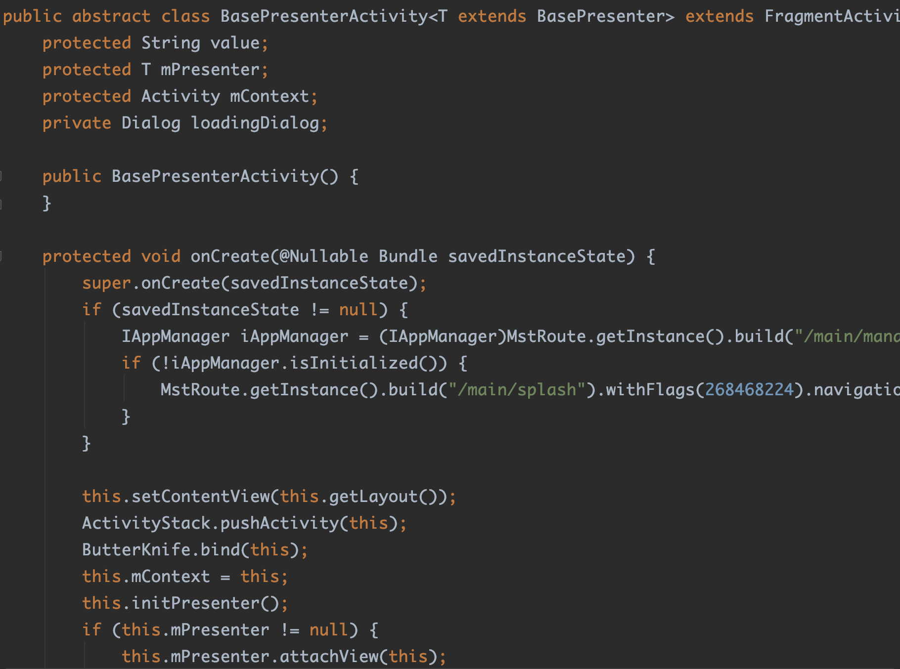

 ### 前言
升学e网通是杭州铭师堂旗下的一款在线教育产品，集助学、助考、和升学为一体,是国内最领先的高中生综合指导系统,专为高中同学打造的提供视频学习、助学备考、志愿填报、升学报考等服务的平台。在客户端的高速业务迭代下，我们对Android客户端的架构进行了一次升级。我们将用这篇文章将我们最近几个月的技术工作进行分享。

早年，我们采用了大多数客户端采用的 MVP 架构。但是随着业务代码的逐步增加，我们遇到了下面几个头疼的问题。

**生命周期的不可控**

在我们早期 MVP 的架构中，view 层就是 Actiivity、Fragment 等承载视图的部分，这部分一般都会有自己的生命周期，在 view 层对象中，会持有一个 Presenter 的对象实例。但是我们没有办法保证 presenter 层对象的生命周期和 view 层保持一致。如果在 v 层对象呗销毁后出现了 presenter 层对 view 层的调用，就会发生不可预料的错误。

例如，我们在 presenter 层加入了最经典的 Retrofit + Rxjava 的代码。当弱网情况下，网络请求没有返回，回退界面，如果当前的 Activity 对象被销毁，而 presenter 内的网络回调完成并调用了 view 层的方法刷新 UI，就会出现 crash

所以我们每次都需要在网络请求的时候对 Rxjava 的 `Flowable` 对象添加订阅，在 v 层对象的生命周期中调用取消订阅。

代码如下：


在团队人员增加的时候，如果在新同学入职的时候不强调这个规则的时候，很容易就会出现线上的 `NullPointException` 异常


**基础对象难以维护**

在 mvp 中，我们抽象出了一些基础类， 例如 `BasePresenterActivity` 和 `BaseActivity`




在 `onCreate` 中，我们可以看到有不少代码逻辑，在未来的开发中，我们可能需要其他的相似功能的 Activity， 或者在某些 Fragment 中，我们需要类似的逻辑。但是，新上手的同学可能只想关心我需要复制哪些 Activity 相关的逻辑，或者只想关心和生命周期相关的逻辑，这时候，Activity 和生命周期的逻辑就耦合在了一起，终究会变得难以维护。

**MVP接口过多，影响可维护性**

我们使用 MVP 的初衷是为了代码分层解耦，利于阅读和维护，但是在代码量增加后却发现，view 层和 presenter 层通过接口来交互，导致接口中定义的方法越来越多，如果修改一个地方的逻辑，可能需要顺着好多个文件来找被影响的方法并修改。

整理一下 MVP 的数据流向，可以发现 MVP 其实是双向的数据流。view 可以把数据传给 presenter， presenter 也可以把数据带给 view。逻辑复杂了之后及其不方便

**团队同学对MVP的理解不一致**

MVP 虽然基本的原理很简单，只是 MVC 的一个改进和变种。但是网上其实也有很多的 MVP 写法。在团队内部，对于是否应该保证 presenter 层只拥有纯 Java/Kotlin 代码，而不出现 Android 的相关包，也有过各自的意见。

综合以上 MVP架构 遇到的问题，升级一套新的架构，让业务代码抽象程度更高，开发更简便，代码更利于维护，迫在眉睫。于是我们开始关注 Google 官方出的 Jetpack 架构组件。

### Jetpack

`Android Jetpack` 是 Google 在今年的 IO 大会上，根据去年 IO 大会上发布的 `Android Architecture Component` 进一步发布的内容，针对我们的问题，我们关注的主要是架构组件。

### Lifecycle

我们使用了 `Lifecycle` 来重构我们的基础 `Activity` 类，将 lifecycle 相关的内容和具体逻辑分类

```kotlin
abstract class BaseActivity: AppCompatActivity() {

    override fun onCreate(savedInstanceState: Bundle?) {
        super.onCreate(savedInstanceState)
        setContentView(bindLayout())
        lifecycle.addObserver(BaseActivityLifecycle(this))
    }

    /**
     * Activity 的 Layout questionId
     */
    abstract fun bindLayout(): Int
}
```

`BaseActivityLifecycle` 的代码如下：


目前，Activity内部的 lifecycle 包含了 `EventBus` 和我们自己的埋点库。我们可以一目了然的看到我们的基类 Activity 在每个生命周期中有哪些三方库或者二方库需要初始化和销毁。如果某个同学需要重构 BaseFragment 类，可以直接复用这个 lifecycle 的代码，也不用担心自己写漏了什么 lifecycle 相关的初始化。


### ViewModel

我们使用 `ViewModel` 来解决自建 MVP 架构中 presenter的生命周期问题。

这里的 `ViewModel` 和 MVVM 的 ViewModel 并不是一回事，简单理解，其实 `ViewModel` 仍然是 `Presenter`。当然，是一个自动管理者生命周期的 `Presenter`， `ViewModel` 的官网简介就是
```
Manage UI-related data in a lifecycle-conscious way
```

从文档里面我们可以看到 `ViewModel` 的基本用法：


从官网的这张图我们也可以看到，`ViewModel` 会随着 view 对象的 `onDestory` 执行 `onCleared` 方法销毁


我们把数据的逻辑存储在 `ViewModel` 中，在 `Activity` 生命周期发生变化的时候，我们可以从 `ViewModel` 中获取数据进行 UI 的恢复。 在 `ViewMdoel` 中，我们也让它承担了一些单纯的逻辑操作的职责。

在文档中我们看到的 `ViewModel` 初始化方式是
```kotlin
ViewModelProviders.of(this).get(ModelClass::class.java)
```

在开发中， 我们也经常需要把上个 Activity 传过来的数据传给 `ViewModel` , 这时候我们可以利用 `ViewModelProvider。Factory` 进行初始化。


我们在团队内的约定是，为了较复杂逻辑的抽象，我们不限制 `Activity` 和 `ViewModel` 的对应关系。一个 `Activity` 中可以持有多个 `ViewModel` 对象。但是，在很多逻辑不算很复杂的页面，可能仍然只是一个 `Activity` 需要一个`ViewModel` 就够了，所以我们也写封装了一个对应的基础类。


其中：

* arguments() 为我们传给 `ViewModel` 的参数，放在 `Bundle` 对象里面。使用这个类的同学只需要关心他传什么值，不需要关心 `Factory` 的使用方法

* viewModelClass() 返回的是 `ViewModel` 的 Class 对象

`ViewModel` 的初始化如下图：


在利用 `Factory` 初始化对象的时候，因为我们使用了反射，所以在 `proguard-rules.pro` 中我们要去掉相关类的混淆。

如果是你自己使用，需要添加
```java
-keepclassmembers public class * extends android.arch.lifecycle.ViewModel {
    public <init>(...);
}
```

例如我们上面封装的，则需要添加
```java
-keepclassmembers public class * extends com.mistong.ewt360.homework.common.viewmodel.BaseViewModel {
    public <init>(...);
}

```

解决了生命周期的问题，那么我们在 `ViewModel` 中获取了逻辑处理的结果，应该如何反馈给 UI 呢？我们选择使用 `LiveData` 完成这些。


`LiveData` 是一个可观察数据的持有者，并且具有生命周期的感知。简单的 `LiveData` 用法如下：

在 `ViewModel` 中给 `LiveData` 赋值,

```kotlin
myLiveData?.post(value)
```

在 view 中，对 `LiveData` 进行观察

```kotlin
mViewModel.myLiveData?.observer{v->
    v?.let{
        updateUI(it)
    }
}
```

关于 `LiveData` 更多的使用，我们会在接下来的章节介绍

在拥有了 `View`, `ViewModel`, `LiveData` 之后，我们梳理了我们的数据流向图


这里我们可以看到，数据的传递方向看其实是一个单向数据流。不会有数据从 UI 层到逻辑层互相扔来扔去的情况。即使代码多了，我们也只需要关注单向的数据变化就能轻松了解到逻辑。代码也更加容易维护。

类比一下，我们也可以发现，这个架构，和前端 `React` + `Redux` 的 `Flux` 架构也十分相似。


实际上，在 `Jetpack` 的源码中，我们也可以看见类似 `Store` 和 `Dispatcher` 的概念。虽然在业务代码的结构我们仍然和 MVP 没有很大差异，但是从整体的角度看，我们的架构更像是 `Flux`

这里，我们就很方便的解决了自建 MVP 中，令人头疼的生命周期问题。也不需要担心数据返回的时候 `View` 已经销毁了。因为这时候 `LiveData` 已经不会再执行 observer 的回调。


### LiveData和数据相关的架构

### Paging的使用

在 `Jetpack` 中，还要一个令人眼前一亮的组件就是 `Paging`。在最新迭代的图片选择组件中，我们也使用了 `Paging` 作为列表分页加载的载体。


`Paging` 将相册选择的逻辑抽象成了几个部分：

##### 数据
* `PagedList` 一个继承了 AbstractList 的 List 子类， 包括了数据源获取的数据
* `DataSource` 数据源的概念，分别提供了 `PageKeyedDataSource`、`ItemKeyedDataSource`、`PositionalDataSource`， 在数据源中，我们可以定义我们自己的数据加载逻辑。

##### UI
* UI 部分 paging 提供了一个新的 `PagedListAdapter`, 在实例化这个 Adapter 的时候，我们需要提供一个自己实现的 `DiffUtil.ItemCallback` 或者 `AsyncDifferConfig`


在相册选择中，我们每页读取一定量的图片，避免一次性加载所有本地图片可能出现的卡顿


配置相对应的配置


到这里我们就实现了一个很优雅的列表分页加载，我们可以画出 `Paging` 简单的架构图


在一般情况下，我们最原始的方式，列表 UI 所在的部分，是需要知道数据的来源等逻辑部分。`Paging`实际是抽象了列表分页加载这个行为的 `Presenter` 层及其下游处理。这种模式，业务的编写者，可以把 UI 部分的代码模板化， 只需要关心业务逻辑，并且把业务逻辑中的数据获取写在 DataSource 中，使分页加载的操作解耦程度更高。


### 总结

通过实践，我们总结了 `Android Jetpack` 组件的一些优点：

* 官方出品，值得在第一时间使用，并且可以保证稳定性
* 解决了自建 MVP 架构关于生命周期难以控制，接口复杂等导致的 部分代码不好维护的问题
* 架构比较清晰，不会出现因为理解差异写出风格不同的代码


同时我们也有一些自己的思考，思考如何去把架构升级这件事做的更好：
* 我们需要整理出现有架构的不足，新的架构升级终究是为了解决痛点问题，不是单纯为了追求新技术而升级架构。
* 架构升级的过程，应该尽量减少对原有架构的侵入性，如果能实现无感知的替换则会更好，某些细节部分可以进行封装，让其他业务线的同学只关注业务的处理过程。


以上我们介绍了升学e网通客户端的架构升级，以及 `Android Jetpack` 在我们团队内的实践。目前，文中介绍的部分都已经上线，部分内容已经经过了几个版本的迭代，没有出现明显的线上 crash


### 远景

在初步进行架构的升级之后，在客户端稳定性的前提下，我们团队将会进一步尝试架构的升级。其中包括：

* DI 的引入：架构在逐步的完善过程中，会分出很多的代码层，例如 数据库、网络、复杂的逻辑处理层。这些对象目前在我们的代码中都是单例类。单例同时也意味着生命周期不好管理，我们需要一个依赖注入库帮助我们管理对象。目前，我们正准备针对kotlin 的 `koin` 进行尝试
* 其他`jetpack`组件的尝试：例如 `Navigation`和`WorkManager`
* Paging 的进一步使用：Paging 在我们的客户端目前没有大量使用，我们在往后将会尝试和现有的三方 RecyclerView 组件结合，在网络请求的场景下使用它来做分页加载逻辑


### 作者
* 烧麦， 铭师堂 Android 开发工程师， 负责升学e网通 APP B端业务开发，CI 以及 H5 容器相关的技术方案
